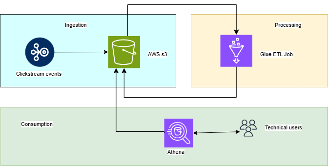
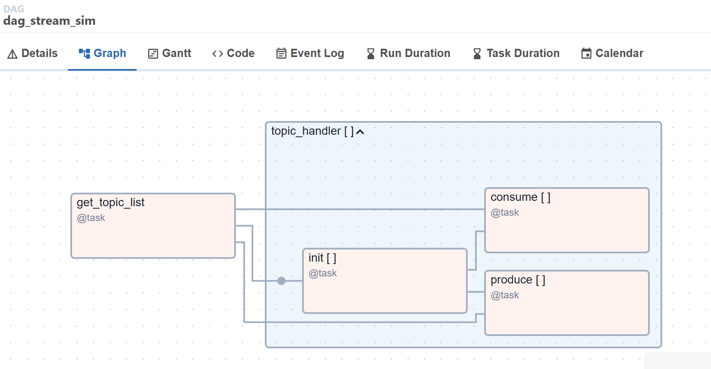
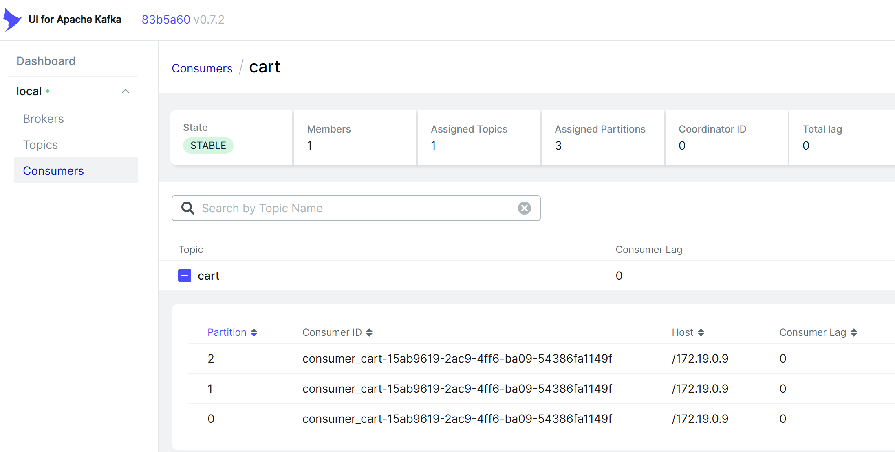
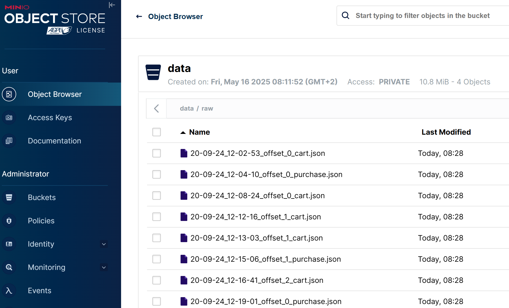

# Clickstream Project

## 1. Scenario and Purpose

An e-commerce company selling electronics noticed stagnant conversion rates. To improve this, they decided to analyze clickstream data to understand user behavior, identify bottlenecks, and optimize the user experience. 

Functional Requirements: 

* Extract and store clickstream data
* Support geographic/user distribution analysis
* Allow ad hoc SQL queries

## 2. Architecture overview

* Ingestion layer: click events streaming collection  
* Processing layer: data wrangling and preparation for analysis
* Consumption layer: processed data are available for query

### Ingestion layer

This layer is responsible for collecting and importing data from various sources into the system.

1. **Current Implementation**
   Simulated streaming using Apache Kafka for message brokering, orchestrated by Apache Airflow, and containerized with Docker for easy deployment. Used MinIO as S3 compatible object storage.

2. **Future Enhancement**
   Integration with AWS S3 for scalable and persistent data ingestion.
   Deployment on AWS ECS Fargate to enable batch processing layer. 

### Processing layer

This layer prepares, cleanses, and transforms raw clickstream data into structured formats suitable for analysis.

1. **Planned Implementation**
   AWS Glue ETL jobs will be used to automate data transformation workflows, enabling scalable and serverless data processing. 

### Consumption layer

This layer enables exploration and analysis of processed data through interactive dashboards and queries.

1. **Planned Implementation**
   Amazon Athena will be used to run SQL queries directly on data stored in S3, providing a serverless and cost-effective analytics solution.

## 3. Project Structure

### High level view



### Pipeline DAG



### Kafka Dashboard



### S3 Dashboard



## 4. Tools

* **a) Python (Data Extract & Load)**
    * Custom-built modules (API data extraction)
    * Pydantic (schema validation)
    * Python Unittest (unit testing)
    * Logging (error handling)
* **b) Apache Airflow (Data Orchestration)**
    * Apache Airflow 2 (via Docker container)
* **c) Apache Kafka (Streaming)**
* **d) Git/Github Actions (Version Control)**
    * CI/CD pipeline (linting, testing, replication)
    * Dev & Prod environments (software development)
* **e) Other**
    * AWS S3 buckets (data storage)
    * `.env` & `dev.env` files (Configuration as Code)
    * `README.md` files (documentation)
    * `requirements.txt` (package management)

## 6. Project Methodology & Technical Details

### Data Extraction and Load

The data pipeline uses the ELT framework, extracting and loading data "as-is" from  
Kafka stream into an AWS S3 bucket.  
Data streaming is emulated from two csv samples containing synthetic data:

1. **Cart events**
   Add product to cart events. Custom Python functions consume record from csv, 
   validate schema using Pydantic, and send message to Kafka.
   Custom Python functions consume message from Kafka and load json data into S3.    

2. **Purchase event**
   Product purchase events. Custom Python functions consume record from csv, 
   validate schema using Pydantic, and send message to Kafka.
   Custom Python functions consume message from Kafka and load json data into S3.    

Orchestration is provided in two ways:

1. **Local mode**
   In a delopment environment, two controllers simulate orchestration with 
   multiprocessing. Kafka producing and consuming manage data on local storage. 

2. **Cloud mode**
   In a stage environment, Airflow manage the orchestration. Kafka producing
   and consuming manage data on S3 storage. 

Unit tests using `unittest` ensure function correctness. Airflow DAGs orchestrate script execution. 

### Github Workflows

CI workflows (`ci.yaml`) on pull requests run linting (Ruff) and `unittest`. 
CD workflows (`cd.yaml`) on merge to main will sync codebase on AWS and rebuild 
Docker images. 

## 7. Future Direction

* Migrating processing to AWS (Airflow on ECS Fargate).
* Infrastructure as Code (IaC) for AWS Fargate.
* Ad hoc analysis with Athena. 
* Upgrade to Airflow 3.

## 8. Miscellaneous

### Project Structure

```bash
├── Dockerfile
├── docker-compose.dev.yml             # Docker launch with local storage
├── docker-compose.stage.yml           # Docker launch with MinIO S3  
├── docker-compose.yml                 # Docker launch with AWS S3 
├── Dockerfile                         # Docker definition Airflow image 
├── .env                               # Envinroment definition for AWS
├── dev.env                            # Envinroment definition for local-mode 
├── .gitignore
├── README.md
├── requirements.txt
├── .github
│   └── workflows
│       ├── ci.yaml
│       └── cd.yaml
├── dags
│   └── dag_stream_sim.py              # Airflow DAG definition
├── data                               # Data samples
│   ├── cart.csv
│   └── purchase.csv   
├── kafka
│   ├── consumer
│   │   ├── consumer_controller.py     # Consumer controller multiprocessing 
│   │   ├── Dockerfile
│   │   └── requirements.txt
│   ├── producer
│   │   ├── producer_controller.py     # Producer controller multiprocessing 
│   │   ├── Dockerfile
│   │   └── requirements.txt
├── logs                               # Logs volume mounted on Airflow
├── plugins                            # Plugins volume mounted on Airflow
├── readme_resources                   # Screenshots
├── src
│   ├── __init__.py
│   ├── aws_utils.py                   # S3 I/O functions   
│   ├── consumer.py                    # Consumer module with S3 I/O operations   
│   ├── local_consumer.py              # Consumer module with local I/O   
│   ├── local_producer.py              # Producer module with local I/O   
│   ├── producer.py                    # Producer module with S3 I/O operations   
│   └── utils.py                       # Kafka clients and utilities  
├── tests                              # Tests suite
│   ├── __init__.py
│   ├── test_aws_utils.py                     
│   ├── test_consumer.py                     
│   ├── test_local_consumer.py                  
│   ├── test_local_producer.py                  
│   └── test_utils.py                          
```